# ITRS Geneos: Standard vs. OpenTelemetry Integration for Hjosephtest Server Monitoring
#### Comparative Monitoring Approaches Flowchart Author  Harry Joseph Date: 2023-09-25 Github Link: https://github.com/hjoseph777/readme.md
This flowchart compares the monitoring approaches for a Hjosephtest server using ITRS Geneos with both the standard setup and the integration of OpenTelemetry. The flowchart highlights the key differences and benefits of each approach, providing a clear visual representation of the monitoring process. click <-> To expand image

```mermaid
flowchart TD
    %% Define improved style classes with better contrast and readability
    classDef standard fill:#0052cc,stroke:#003380,stroke-width:2px,color:white,font-weight:bold,font-family:Arial
    classDef otel fill:#00875a,stroke:#005a3c,stroke-width:2px,color:white,font-weight:bold,font-family:Arial
    classDef common fill:#f5f5f5,stroke:#333333,stroke-width:1px,font-family:Arial
    classDef server fill:#ff8000,stroke:#cc5500,stroke-width:3px,color:white,font-weight:bold,font-size:16px,font-family:Arial
    classDef header fill:#5c2d91,stroke:#371863,stroke-width:2px,color:white,font-weight:bold,font-size:14px,font-family:Arial
    
    Server["Hjosephtest Server"]
    
    %% Main Branches with improved titles
    Server --> StandardApproach["🔷 ITRS Geneos Standard Setup"]
    Server --> OTELApproach["🔶 ITRS Geneos with OpenTelemetry"]
    
    %% Standard Approach - SQL Monitoring
    StandardApproach --> SQLStd["SQL Database Monitoring"]
    SQLStd --> SQLStdTool["Tool: Database Plug-in"]
    SQLStdTool --> SQLStdMetrics["Metrics:
    - Query Execution Time
    - Connection Pool Usage
    - Query Errors"]
    SQLStdMetrics --> SQLStdConfig["Configuration:
    - Set thresholds for alerts
    - Define slow query parameters
    - Alert on connection failures"]
    
    %% Standard Approach - CPU Monitoring
    StandardApproach --> CPUStd["CPU Monitoring"]
    CPUStd --> CPUStdTool["Tool: Netprobe with OS Plug-in"]
    CPUStdTool --> CPUStdMetrics["Metrics:
    - CPU Utilization (%)
    - Load Average
    - Idle Time"]
    CPUStdMetrics --> CPUStdConfig["Configuration:
    - Alert on high CPU usage (>85%)
    - Detect unusual spikes
    - Monitor sustained load"]
    
    %% Standard Approach - Process Monitoring
    StandardApproach --> ProcessStd["Process Monitoring"]
    ProcessStd --> ProcessStdTool["Tool: Process Plug-in"]
    ProcessStdTool --> ProcessStdMetrics["Metrics:
    - Process State
    - Memory Usage
    - CPU Usage per Process"]
    ProcessStdMetrics --> ProcessStdConfig["Configuration:
    - Alert on critical process failures
    - Monitor resource overuse
    - Track zombie processes"]
    
    %% Standard Approach - Network Monitoring
    StandardApproach --> NetworkStd["Network Latency Monitoring"]
    NetworkStd --> NetworkStdTool["Tool: Network Plug-in"]
    NetworkStdTool --> NetworkStdMetrics["Metrics:
    - Ping Latency
    - Packet Loss
    - Bandwidth Utilization"]
    NetworkStdMetrics --> NetworkStdConfig["Configuration:
    - Set latency thresholds
    - Alert on packet loss
    - Monitor bandwidth saturation"]
    
    %% OTEL Approach - SQL Monitoring
    OTELApproach --> SQLOTEL["SQL Database Monitoring"]
    SQLOTEL --> SQLOTELTool["Tool: OTEL Collector with SQL Exporter"]
    SQLOTELTool --> SQLOTELMetrics["Metrics:
    - Query Durations
    - Database Errors
    - Transaction Rates"]
    SQLOTELMetrics --> SQLOTELConfig["Integration:
    - Forward to Geneos Collection-Agent
    - Map to Geneos dataviews
    - Unified dashboard visualization"]
    
    %% OTEL Approach - CPU Monitoring
    OTELApproach --> CPUOTEL["CPU Monitoring"]
    CPUOTEL --> CPUOTELTool["Tool: OTEL System Metrics Exporter"]
    CPUOTELTool --> CPUOTELMetrics["Metrics:
    - CPU Core Utilization
    - System Load
    - Interrupt Time"]
    CPUOTELMetrics --> CPUOTELConfig["Integration:
    - Convert to Geneos dataviews
    - Correlate with other metrics
    - Standardized data format"]
    
    %% OTEL Approach - Process Monitoring
    OTELApproach --> ProcessOTEL["Process Monitoring"]
    ProcessOTEL --> ProcessOTELTool["Tool: OTEL Process Exporter"]
    ProcessOTELTool --> ProcessOTELMetrics["Metrics:
    - Process Count
    - Resource Consumption
    - Process Restarts"]
    ProcessOTELMetrics --> ProcessOTELConfig["Integration:
    - Combine with Geneos for unified alerting
    - End-to-end process visibility
    - Distributed process tracking"]
    
    %% OTEL Approach - Network Monitoring
    OTELApproach --> NetworkOTEL["Network Latency Monitoring"]
    NetworkOTEL --> NetworkOTELTool["Tool: OTEL Network Exporter"]
    NetworkOTELTool --> NetworkOTELMetrics["Metrics:
    - Round Trip Time (RTT)
    - Throughput
    - Error Rates"]
    NetworkOTELMetrics --> NetworkOTELConfig["Integration:
    - Combine with Geneos for correlation
    - End-to-end path analysis
    - Service dependency mapping"]
    
    %% Gateway Connections - with improved styling
    SQLStdConfig --> GatewayStd["GENEOS GATEWAY (Standard)
    - Central alert management
    - Traditional plug-in architecture
    - Direct data collection"]
    CPUStdConfig --> GatewayStd
    ProcessStdConfig --> GatewayStd
    NetworkStdConfig --> GatewayStd
    
    SQLOTELConfig --> CollectionAgent["COLLECTION-AGENT
    - OTel receiver plugin
    - Data transformation
    - Dataview mapping"]
    CPUOTELConfig --> CollectionAgent
    ProcessOTELConfig --> CollectionAgent
    NetworkOTELConfig --> CollectionAgent
    
    CollectionAgent --> GatewayOTEL["GENEOS GATEWAY (OTEL)
    - Unified monitoring
    - Standardized data ingest
    - Enhanced correlation"]
    
    %% Data Flow Visualization
    GatewayStd --> Alerts["ALERTS & DASHBOARDS"]
    GatewayOTEL --> Alerts
    
    %% Apply styles
    class Server server
    class StandardApproach,GatewayStd header
    class OTELApproach,GatewayOTEL,CollectionAgent header
    class SQLStd,CPUStd,ProcessStd,NetworkStd,SQLStdTool,CPUStdTool,ProcessStdTool,NetworkStdTool,SQLStdMetrics,CPUStdMetrics,ProcessStdMetrics,NetworkStdMetrics,SQLStdConfig,CPUStdConfig,ProcessStdConfig,NetworkStdConfig standard
    class SQLOTEL,CPUOTEL,ProcessOTEL,NetworkOTEL,SQLOTELTool,CPUOTELTool,ProcessOTELTool,NetworkOTELTool,SQLOTELMetrics,CPUOTELMetrics,ProcessOTELMetrics,NetworkOTELMetrics,SQLOTELConfig,CPUOTELConfig,ProcessOTELConfig,NetworkOTELConfig otel
    class Alerts common
```

## Key Differences

### Data Collection Approach
- STANDARD SETUP: Direct collection via purpose-built Geneos plugins
- OPENTELEMETRY: Standardized collection protocol with interoperable exporters

### Metrics Granularity
- STANDARD SETUP: Predefined metrics based on plugin capabilities
- OPENTELEMETRY: Highly customizable metrics with additional dimensions and context

### Integration Capability
- STANDARD SETUP: Primarily integrated within the Geneos ecosystem
- OPENTELEMETRY: Interoperates with multiple observability tools and platforms

### Deployment Model
- STANDARD SETUP: Plugin-centric deployment with direct Gateway connection
- OPENTELEMETRY: Collector-based deployment with standardized data pipeline

### Scalability
- STANDARD SETUP: Traditional scaling model tied to Netprobe capacity
- OPENTELEMETRY: Highly scalable with distributed collection pipeline architecture

### Modern Architecture Support
- STANDARD SETUP: Designed primarily for traditional infrastructure monitoring
- OPENTELEMETRY: Native support for cloud-native, containerized, and microservice environments

## Advantages of OpenTelemetry Integration

1. **Standardization**: Industry-standard protocol reduces vendor lock-in
2. **Instrumentation Reuse**: Single instrumentation for multiple observability tools
3. **Reduced Overhead**: More efficient data collection and transmission
4. **Future-Proof**: Growing ecosystem and community support
5. **Complete Observability**: Unified metrics, logs, and traces collection
6. **Modern Architecture Support**: Better suited for cloud-native applications

## Advantages of Standard Geneos Setup

1. **Mature Ecosystem**: Well-established plugins with proven reliability
2. **Specialized Monitoring**: Purpose-built tools for specific systems
3. **Simplified Deployment**: Direct integration without additional components
4. **Optimized Performance**: Tuned specifically for Geneos platform
5. **Lower Learning Curve**: Consistent approach within Geneos framework
